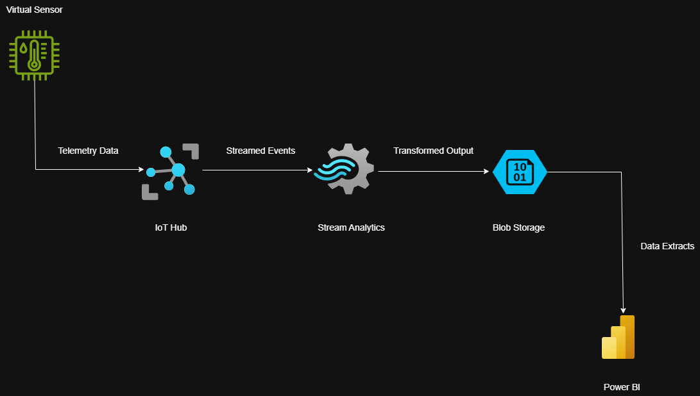
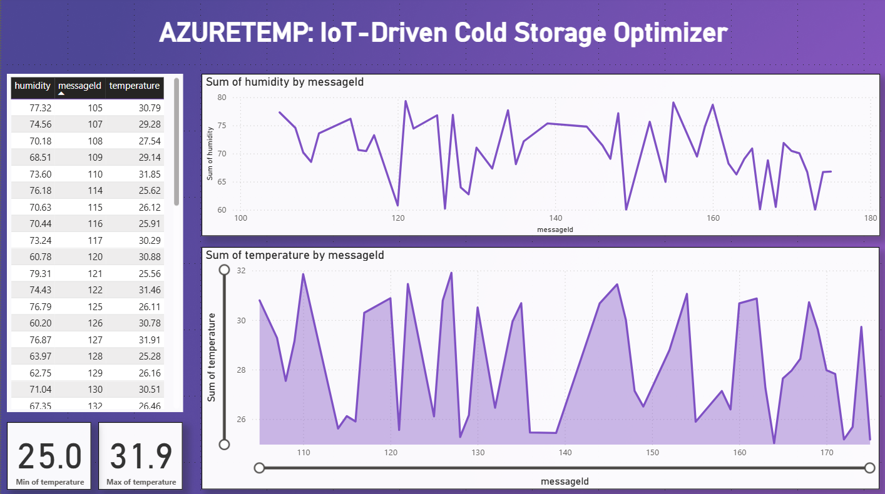

# 🌡️ IoT Driven Cold Storage Optimizer

The project is a proof of concept prototype built using Microsoft Azure that simulates temperature and humidity monitoring in cold storage environments. Inspired by the growing need for energy efficient and automated solutions in food logistics, it demonstrates how cloud computing can power an end to end data pipeline from sensor to dashboard with the goal of optimizing operations and reducing energy consumption.

---

## 🔁 Data Flow Overview

The system begins with a Raspberry Pi virtual sensor that generates temperature and humidity data. This data is ingested by Azure IoT Hub, which acts as a central communication point for telemetry. The stream is then processed and filtered in real time by Azure Stream Analytics, ensuring only relevant and clean data is passed forward. Processed output is stored in Azure Blob Storage in JSON format. Finally, the structured data is imported into Power BI, where interactive dashboards provide real-time insights into cold storage conditions.

---

## 🖼️ Architecture Diagram

---

## 📊 Dashboard Example

---

## 📈 Dashboard Features

The Power BI dashboard provides real-time visualizations based on the sensor data streamed through Azure. Key features include:

- **Live Data Table**: Displays recent humidity, temperature, and message ID values in a scrollable format.
- **Temperature & Humidity Trends**: Line and area charts show variations over time, helping identify anomalies or system fluctuations.
- **Min/Max Cards**: Quickly highlight the minimum and maximum recorded temperatures for easy monitoring.
- **Clean Layout & Theming**: A stylized purple theme and intuitive layout designed for clarity and quick analysis.

These visuals would allow the stakeholders to monitor cold storage conditions, identify abnormalities, and make data-driven decisions to optimize energy usage and preserve food quality.

---

## 🧰 Tools and Technologies Used

- **Programming**: Node.js (`azure-iot-device`, `bme280-sensor`, `wiring-pi`)
- **Cloud Platform**: Microsoft Azure  
  - IoT Hub  
  - Stream Analytics  
  - Blob Storage  
- **Dashboarding**: Power BI

---

## Acknowledgements

This project was developed as part of an academic study on Cloud Management and was a collaboration with stakeholders.  
It builds upon Microsoft Azure IoT sample code licensed under the MIT License.
